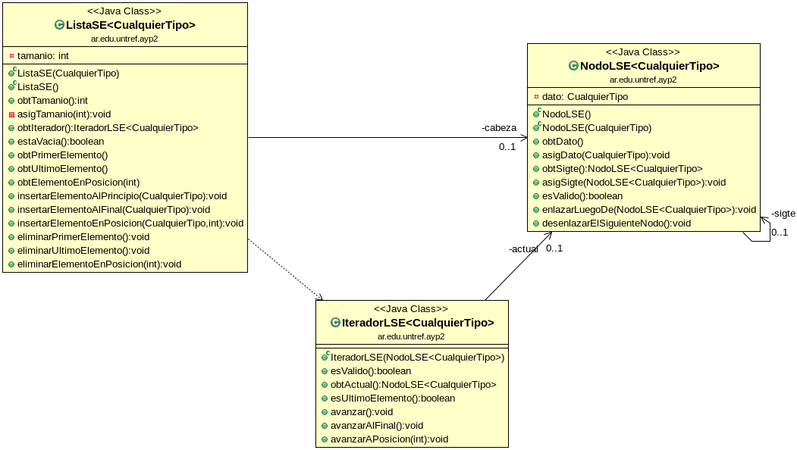

# lista-enlazada-con-tdd

Una implementación de Lista Enlazada libre, desarrollada desde cero mediante TDD (Test-Driven Development).

Material complementario a la Clase de Listas Enlazadas de la Cátedra "[Algoritmos y Programación II](https://sites.google.com/untref.edu.ar/aypii/)", de la [Ingeniería en Computación](http://www.untref.edu.ar/carrera/ingenieria-en-computacion) de la [UNTREF](https://untref.edu.ar).

## Diseño

## Descargar

https://github.com/untref-ayp2/estructuras--lista-enlazada-con-tdd

## Uso

[Video de la clase en YouTube](https://www.youtube.com/playlist?list=PLxr02vIjy-K__URKYLikt9kJ8AsHspkPs). (Licencia: [CC-BY](https://creativecommons.org/licenses/by/4.0/)).

Se recomienda seguir el desarrollo con alguna herramienta como [Git-Time-Machine](https://github.com/littlebee/git-time-machine).

Si bien esta implementación ha sido desarrollada mediante pruebas, y su uso académico es bienvenido (se agradecen referencias), la función de esta implementación es meramente ilustrativa del funcionamiento interno de la estructura de datos: **DEBE EVITARSE EL USO EN PRODUCCIÓN DE ESTE SOFTWARE**. Para esos casos, utilizar [la Lista Enlazada nativa de Java, (LinkedList)](https://docs.oracle.com/en/java/javase/11/docs/api/java.base/java/util/LinkedList.html).

## Reconocimientos

Esta implementación fue inspirada por [la implementación de Lista Enlazada de Weiss](http://users.cis.fiu.edu/~weiss/#dsj4) (aunque no está basada en ella). A diferencia de esa implementación no libre, el funcionamiento de esta es más cercana al funcionamiento de [la Lista Enlazada nativa de Java, (LinkedList)](https://docs.oracle.com/en/java/javase/11/docs/api/java.base/java/util/LinkedList.html).

## Licencia

Copyleft © desde 2020, Leandro Doctors.

Este programa es Software Libre: puede redistribuirse y/o modificarse
bajo los términos de la Licencia General Pública Affero de GNU (GNU Affero General Public License), tal como la publica la Free Software Foundation (Fundación para el Software Libre), ya sea la versión 3 de la Licencia, o
(a tu elección) cualquier versión posterior.

Este programa se distribuye con la esperanza de que sea útil, pero SIN NINGUNA GARANTÍA; incluso sin la garantía implícita de 
COMERCIABILIDAD o ADECUACIÓN PARA UN PROPÓSITO PARTICULAR. Leer la Licencia General Pública Affero de GNU para más detalles.

Deberías haber recibibido una copia de la Licencia General Pública Affero de GNU junto a este programa. Si no, ver <http://www.gnu.org/licenses/>.
